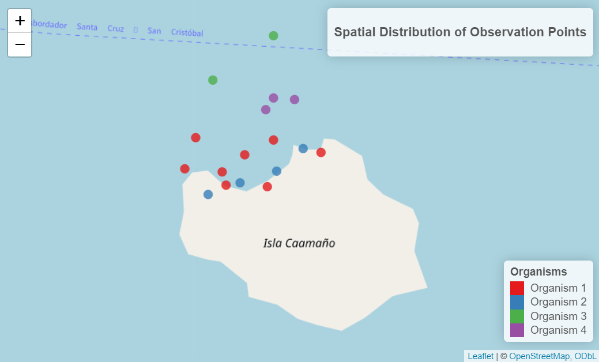

# Integration of etological observations (BORIS), flight records (UAV) and environmental conditions using R

## Objective of this Protocol

Protocol for Synchronizing Drone Flight Data with BORIS-Based Behavioral Observations

## Required Software

-   BORIS (Behavioral Observation Research Interactive Software)

    An open-source tool designed for the observation and coding of animal and human behaviors in ethological studies. It is used to systematically record and categorize events such as:

    -   Specific movements: swimming, diving, resting
    -   Social interactions: aggression, play, mating
    -   Stimulus responses: fear, exploration, feeding

    It enables subsequent behavioral pattern analysis and helps understand how these organisms interact with their environment.

-   QGIS

    Geographic Information System (GIS) tool

-   RStudio

    Statistical analysis software

## Datasets

-   Flight Logs (CSV Drone)
-   Observation Records (CSV Boris)
-   Environmental Conditions Records (XLSX Logbook)

## Results

Spatial Distribution of Biological Observation Points Across the Study Area

## License

This project is licensed under the **Creative Commons Attribution 4.0 International (CC BY 4.0)**.\
© Cristian Jitala | FCD. See the [LICENSE](./LICENSE) file for details.

## About the Author

This project was developed by **Cristian Jitala | FCD**
